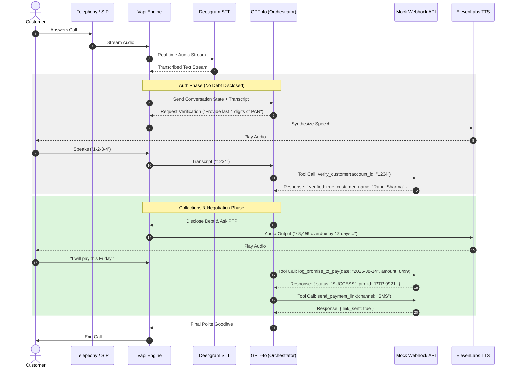

# Maya: High-Level Design Document

## 1. Pipeline & Latency Budget

The end-to-end call flow for the Maya collections assistant is designed to keep round-trip latency under the target threshold of 1.2 seconds.



### Target latency budget

| Hop | Component | Budget | Target |
|---|---|---:|---:|
| 1 | Telephony / SIP setup | 80 ms | < 100 ms |
| 2 | Deepgram STT | 200 ms | ~200 ms |
| 3 | LLM first token / reasoning | 400 ms | ~400 ms |
| 4 | TTS synthesis | 300 ms | ~300 ms |
| 5 | Network / orchestration overhead | 200 ms | ~200 ms |
| Total | End-to-end round trip | 1,180 ms | < 1.2 s |

### Design notes

- The auth phase is intentionally constrained to minimize risk of premature disclosure.
- The orchestrator uses a strict stateful conversation policy to avoid cross-turn leakage.
- TTS and tool actions should be triggered only after transcript finalization and gate checks.

## 2. State Machine

### Required states

- `INIT`
- `AUTH_PENDING`
- `AUTHENTICATED`
- `NEGOTIATION`
- `PTP_COLLECTED`
- `ESCALATED`
- `CALL_ENDED`

### Transition rules

1. `INIT` -> `AUTH_PENDING` when the call is answered and greeting begins.
2. `AUTH_PENDING` -> `AUTHENTICATED` only after a successful `verify_customer(status: success)` tool response.
3. `AUTH_PENDING` -> `CALL_ENDED` when the customer is a wrong person, DNC request is logged, or identity fails repeatedly.
4. `AUTHENTICATED` -> `NEGOTIATION` when the agent is allowed to disclose account status and ask about payment intent.
5. `NEGOTIATION` -> `PTP_COLLECTED` when the customer agrees to a payment date and amount.
6. `NEGOTIATION` -> `ESCALATED` when there is a dispute, hardship escalation, or manual intervention required.
7. `PTP_COLLECTED` / `ESCALATED` -> `CALL_ENDED` after final closure or disposition logging.

### Strict guardrail

Transitions out of `AUTH_PENDING` to `AUTHENTICATED` are strictly locked behind the successful return of `verify_customer(status: success)`. If the function returns `verified: false`, the agent may continue with verification prompts but cannot disclose debt or account details.

## 3. Intents & Entities Table

### Intents

| Intent | Description | Typical Action |
|---|---|---|
| `Confirm_Identity` | Ask whether the caller is the customer | Greeting and identity hook |
| `Promise_To_Pay` | Customer agrees to a future payment | Call `log_promise_to_pay` |
| `Hardship_Claim` | Customer states financial difficulty | Offer options or `escalate_to_agent` |
| `Dispute_Debt` | Customer disputes the amount or account | `escalate_to_agent` |
| `Already_Paid` | Customer says payment was already made | `mark_disposition(ALREADY_PAID)` |
| `Request_DNC` | Customer requests opt-out | `mark_disposition(DO_NOT_CALL)` |
| `Wrong_Person` | Wrong caller or not the target customer | `mark_disposition(WRONG_PERSON)` |

### Entities

| Entity | Type | Example |
|---|---|---|
| `PTP_Date` | ISO-8601 date | `2026-08-14` |
| `PTP_Amount` | Number | `8499` |
| `Hardship_Reason` | String | `job loss`, `medical emergency` |
| `Verification_Code` | String | `1234`, `1995` |
| `Account_ID` | String | `ACC-88392` |

## 4. Tool / API Specifications

### `verify_customer`

Request JSON:

```json
{
  "account_id": "ACC-88392",
  "verification_code": "1234"
}
```

Success response:

```json
{
  "verified": true,
  "customer_name": "Rahul Sharma",
  "message": "Identity verified successfully."
}
```

Failure response:

```json
{
  "verified": false,
  "customer_name": null,
  "message": "Verification failed. Incorrect code."
}
```

### `log_promise_to_pay`

Request JSON:

```json
{
  "account_id": "ACC-88392",
  "ptp_date": "2026-08-14",
  "amount": 8499
}
```

Success response:

```json
{
  "success": true,
  "ptp_id": "PTP-9921",
  "confirmed_date": "2026-08-14",
  "amount": 8499
}
```

### `send_payment_link`

Request JSON:

```json
{
  "account_id": "ACC-88392",
  "channel": "SMS"
}
```

Success response:

```json
{
  "success": true,
  "message": "Payment link sent successfully via SMS to registered mobile number."
}
```

### `escalate_to_agent`

Request JSON:

```json
{
  "account_id": "ACC-88392",
  "reason": "HARDSHIP_REQUEST",
  "notes": "Customer reports job loss and requests extension."
}
```

Success response:

```json
{
  "success": true,
  "escalation_id": "ESC-4412",
  "queued": true
}
```

### `mark_disposition`

Request JSON:

```json
{
  "account_id": "ACC-88392",
  "status": "PTP_AGREED",
  "notes": "Customer agreed to pay ₹8,499 by 2026-08-14."
}
```

Success response:

```json
{
  "success": true,
  "disposition_logged": "PTP_AGREED",
  "timestamp": "2026-08-12T10:41:00.000Z"
}
```

## 5. Auth & Data Safety Protocols

- Mask PII on logs using patterns such as `Rahul S****` instead of the full name.
- Zero debt mention until `verify_customer` returns positive verification.
- No unapproved mention of terms such as “overdue”, “loan”, “EMI”, or “Kapture Finance debt” before authentication.
- Log only minimal metadata required for compliance and operations.
- Maintain a strict call-state gate to prevent especially sensitive account details from being revealed in pre-auth stages.
- Use time-window enforcement for calls: only place outbound calls between 08:00 AM and 07:00 PM local time.

## 6. Compliance & Guardrails

### RBI / local compliance

- Calls are only made within the legal / approved calling window.
- Identity verification must happen before debt disclosure.
- Any opt-out or DNC request is honored immediately and logged.
- The assistant must not threaten or intimidate the customer.
- The agent should avoid unauthorized settlement or waiver commitments above permitted thresholds.

### Hallucination prevention

- Stop and ask clarifying questions when the customer’s statement conflicts with account status.
- Do not invent payment arrangements or legal consequences.
- Only mention account facts already available in the CRM or tool response.
- Never promise waivers above 10% without explicit authorization.
- If the request is outside approved policy, route to human escalation.

## 7. Edge Cases Matrix

| Scenario | System Behavior | Disposition |
|---|---|---|
| Abusive user | One warning, then soft hang up | `ABUSIVE_CALL` or `HANGUP` |
| Silent user / voicemail | Two re-prompts, then close | `NO_INPUT` |
| Mid-call language switch | Prompt fallback to Hindi / English and continue state | same state preserved |
| Wrong person | Ask if target customer is available and end politely | `WRONG_PERSON` |
| DNC request | Acknowledge and log immediately | `DO_NOT_CALL` |
| Hardship claim | Express empathy and route to escalation | `HARDSHIP_ESCALATED` |
| Already paid | Ask for proof, log valid dispute, close politely | `ALREADY_PAID` |
| Dispute amount | Route to grievance desk or human agent | `DISPUTED` |

## 8. Observability Metrics

### KPIs

- `Containment Rate`: Percentage of calls resolved without human escalation.
- `PTP Rate`: Percentage of calls ending in a valid promise to pay.
- `First Call Resolution (FCR)`: Percentage of valid dispositions logged in the first call attempt.
- `Auth Pass Rate`: Percentage of calls successfully verified before debt disclosure.
- `DNC Log Rate`: Percentage of calls triggered due to opt-out or wrong-number requests.

### Example tracking schema

```json
{
  "call_id": "CALL-9081",
  "customer_id": "ACC-88392",
  "state": "PTP_COLLECTED",
  "containment": true,
  "ptp_rate": true,
  "fcr": true,
  "auth_passed": true,
  "timestamp": "2026-08-12T10:41:00.000Z"
}
```

## 9. Operational Risks & Mitigations

- Risk: early debt disclosure before auth. Mitigation: tool gating and prompt-level guardrails.
- Risk: wrong tool schemas or mismatched function names. Mitigation: validate JSON definitions and server responses against Vapi contracts.
- Risk: audio latency issues. Mitigation: reduce model temperature, use low-latency TTS, and keep prompts concise.
- Risk: opt-out noncompliance. Mitigation: DNC immediate logging and call termination logic.

## 10. Summary

Maya combines a stateful, prompt-governed outbound collections assistant with a mock webhook backend so that a lending organization can test legal compliance, agent behavior, and tool-calling flows before production deployment. The design prioritizes identity assurance, operational safety, and graceful escalation while keeping the call experience empathetic and efficient.
